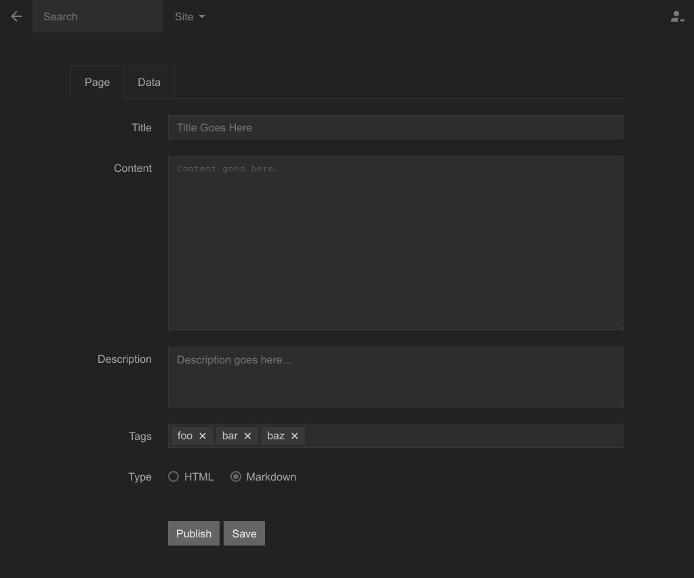
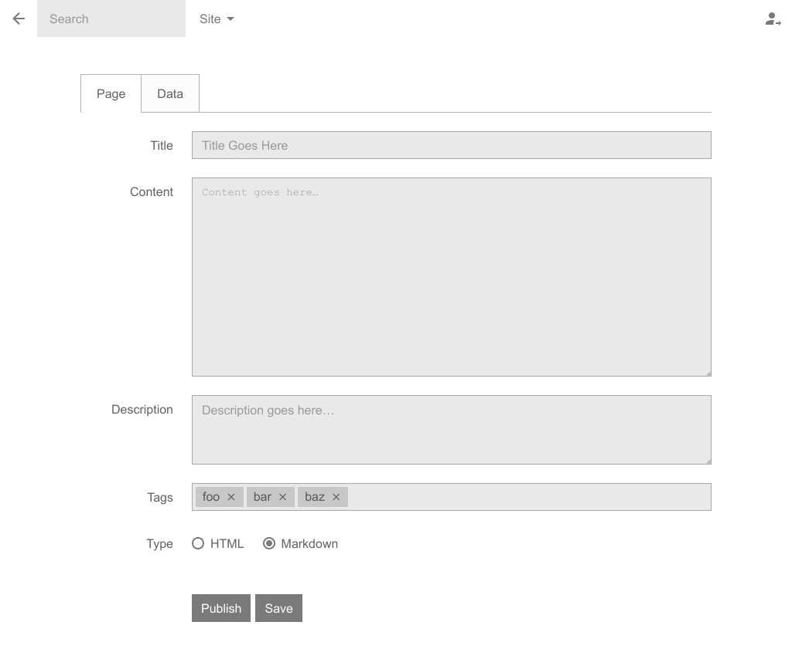

Default Skin for Mecha&rsquo;s [Panel](https://github.com/mecha-cms/x.panel)
============================================================================

---

Release Notes
-------------

### 2.0.0

 - Make this skin as separate extension.